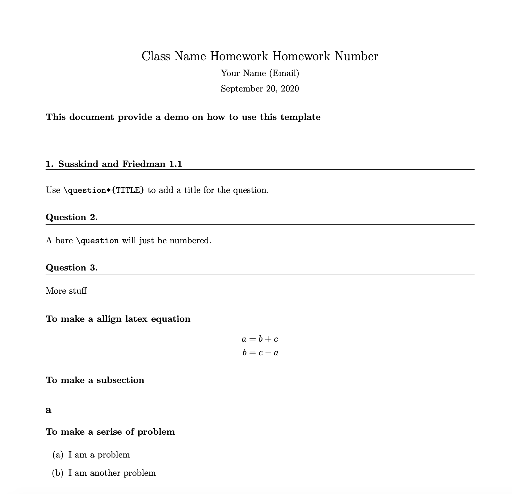

R Markdown Templates: LaTex Homework
======================================================

## How to install
Open Rstudio's console and type following command

```
install.packages("devtools")
devtools::install_github("https://github.com/Kecheng-Ye/rmd_template")
```

This will install the package `LaTexTemplate`. Once installed, they will be available within the R Markdown templates as shown below:


## The snapshot of the template


